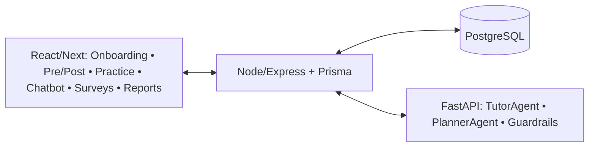

# AGENTS.md

> **Producto:** Plataforma de aprendizaje de matemáticas con IA
> **Propósito de investigación:** evaluar impacto en **aprendizaje autónomo** y **motivación**, con **GE vs GC** (pre–post) y **TAM** como moderador.
> **Resultado técnico clave:** dataset reproducible `/exports/ancova-dataset` + trazabilidad (consentimiento, asignación, versiones de instrumentos, telemetría).

---

## 1) Arquitectura (visión rápida)



**Módulos**

- **Frontend**: React/Next (assessments bloquean IA; práctica con hints; encuestas Likert). Nuevas vistas implementadas: consentimiento (`/study/consent`), pretest (`/study/pretest`), exit test (`/study/exit-test`), dashboard con gating GE/GC y encuesta de satisfacción rediseñada.
- **Backend**: Express + Prisma (auth, asignación, feature-gating, exports, generador IA de práctica).
- **AI Service (FastAPI)**: TutorAgent (explicaciones/hints), generador de teoría (Gemini) con guardrails (redacción/PII).
- **DB**: PostgreSQL (ver esquema).

---

## 2) Agentes (comportamiento)

### 2.1 TutorAgent

- Modo **GE**: pistas graduadas → explicación paso a paso → solución bajo petición.
- Modo **GC**: **deshabilitado** (UI y API rechazan peticiones).
- **Logs** en `feedback_ia` (tipo: hint/explicación/motivación), sin PII.

### 2.2 PlannerAgent / TheoryGen

- Usa **pretest**, errores por dominio y telemetría (`eventos`) para planificar **siguientes ejercicios** (dificultad adaptativa).
- Entrega objetivos de sesión (p. ej., “≥3 sesiones/semana”).
- Genera módulos de teoría personalizados vía FastAPI + Gemini (`/study/theory/generate`) para participantes **GE**.
- Para cohortes **GC** o si el servicio IA falla, se sirve una biblioteca de módulos estáticos (3 plantillas rotativas) con teoría, ejemplos guiados, visualizaciones y checkpoints precurados; los registros en `theoryModules` indican `version=control-v1` o `fallback` según corresponda.
- El backend controla condiciones de carrera (`P2002`) y reutiliza módulos recientes.

### 2.3 PracticeGen Agent (nuevo)

- `/activities/exercise` y `/activities/exercise/submit` ahora generan ítems on-demand con LLM (Gemini u OpenAI según `AI_PROVIDER`).
- Prompt maestro produce JSON con feedback inmediato (`explain_correct`, `explain_incorrect`). Se valida y persiste en `PracticeGenerated` y `PracticeAttempt` para trazabilidad y reutilización.
- Para cohortes **GC** (o fallos IA) se entrega un set curado (`practice_v1`) con al menos 10 ítems manuales; los intentos se registran igual, pero no se consulta al LLM.

### 2.4 AssessmentAgent

- Pre/Post **sin IA**. Ítems de **banco** versionado; cronómetro; anti-copy.
- Guarda **respuestas por ítem** para psicometría (α, dificultad, discriminación).

### 2.5 ExportAgent

- Construye vista consolidada (**una fila por usuario**) para ANCOVA/moderación/dosis-respuesta.

---

## 3) Esquema de datos (PostgreSQL)

> **Claves** para el diseño cuasi-experimental: `asignaciones`, `consentimientos`, **item-level** en test/encuestas, `eventos` (telemetría), **versionado** de instrumentos.

### 3.1 Tablas núcleo (DDL abreviado)

```sql
-- Usuarios (PII separada del id analítico)
CREATE TABLE usuarios (
  id_usuario UUID PRIMARY KEY DEFAULT gen_random_uuid(),
  email TEXT UNIQUE NOT NULL,
  nombre TEXT,
  edad INT,
  nivel_estudio TEXT,
  created_at TIMESTAMPTZ DEFAULT now()
);

-- Consentimiento
CREATE TABLE consentimientos (
  id SERIAL PRIMARY KEY,
  id_usuario UUID REFERENCES usuarios(id_usuario),
  acepta BOOLEAN NOT NULL,
  version_documento TEXT NOT NULL,
  fecha TIMESTAMPTZ DEFAULT now()
);

-- Asignación experimental
CREATE TABLE asignaciones (
  id SERIAL PRIMARY KEY,
  id_usuario UUID REFERENCES usuarios(id_usuario),
  grupo TEXT CHECK (grupo IN ('GE','GC')) NOT NULL,
  metodo TEXT CHECK (metodo IN ('azar','emparejamiento')) NOT NULL,
  seed TEXT,
  fecha_asignacion TIMESTAMPTZ DEFAULT now()
);

-- Banco de ítems (test)
CREATE TABLE banco_items_test (
  id_item SERIAL PRIMARY KEY,
  version_test TEXT NOT NULL,
  dominio TEXT,
  competencia TEXT,
  enunciado TEXT NOT NULL,
  opciones JSONB NOT NULL,    -- [{key:'A',text:'...'},{...}]
  correcta TEXT NOT NULL
);

-- Evaluaciones (pre/post) y respuestas por ítem
CREATE TABLE evaluaciones (
  id_eval SERIAL PRIMARY KEY,
  id_usuario UUID REFERENCES usuarios(id_usuario),
  tipo_eval TEXT CHECK (tipo_eval IN ('pretest','postest')) NOT NULL,
  version_test TEXT NOT NULL,
  puntaje_total INT,
  inicio TIMESTAMPTZ,
  fin TIMESTAMPTZ
);

CREATE TABLE respuestas_test (
  id SERIAL PRIMARY KEY,
  id_eval INT REFERENCES evaluaciones(id_eval) ON DELETE CASCADE,
  id_item INT REFERENCES banco_items_test(id_item),
  respuesta TEXT,
  correcta BOOLEAN
);

-- Encuestas (motivación, autonomía, TAM) – item-level
CREATE TABLE encuesta_items (
  id_item SERIAL PRIMARY KEY,
  instrumento TEXT,            -- 'motivacion','autonomia','tam'
  subescala TEXT,              -- 'utilidad','facilidad', etc.
  version_encuesta TEXT,
  texto TEXT NOT NULL
);

CREATE TABLE encuestas (
  id_encuesta SERIAL PRIMARY KEY,
  id_usuario UUID REFERENCES usuarios(id_usuario),
  instrumento TEXT,
  version_encuesta TEXT,
  fecha TIMESTAMPTZ DEFAULT now()
);

CREATE TABLE encuesta_respuestas (
  id SERIAL PRIMARY KEY,
  id_encuesta INT REFERENCES encuestas(id_encuesta) ON DELETE CASCADE,
  id_item INT REFERENCES encuesta_items(id_item),
  valor INT CHECK (valor BETWEEN 1 AND 5)
);

-- Telemetría (dosis de tratamiento)
CREATE TABLE eventos (
  id SERIAL PRIMARY KEY,
  id_usuario UUID REFERENCES usuarios(id_usuario),
  tipo_evento TEXT,            -- 'sesion_start','sesion_end','hint','correct','wrong','streak'
  metadata JSONB,
  ts TIMESTAMPTZ DEFAULT now()
);

-- Actividades de práctica (agregados)
CREATE TABLE actividades (
  id SERIAL PRIMARY KEY,
  id_usuario UUID REFERENCES usuarios(id_usuario),
  tipo TEXT,                   -- 'ejercicio','quiz','flashcard'
  correctos INT,
  intentos INT,
  duracion_seg INT,
  fecha TIMESTAMPTZ DEFAULT now()
);

-- Feedback del agente
CREATE TABLE feedback_ia (
  id SERIAL PRIMARY KEY,
  id_usuario UUID REFERENCES usuarios(id_usuario),
  id_actividad INT REFERENCES actividades(id),
  tipo_mensaje TEXT,           -- 'hint','explicacion','motivacion'
  prompt_hash TEXT,            -- sin PII
  tokens INT,
  fecha TIMESTAMPTZ DEFAULT now()
);

-- Feature flags por usuario (gating GE/GC)
CREATE TABLE feature_flags (
  id SERIAL PRIMARY KEY,
  id_usuario UUID REFERENCES usuarios(id_usuario),
  chatbot BOOLEAN DEFAULT false,
  adaptativo BOOLEAN DEFAULT false
);

-- Items generados por IA (práctica)
CREATE TABLE practice_generated (
  practice_generated_id SERIAL PRIMARY KEY,
  user_id INT REFERENCES users(user_id) ON DELETE CASCADE,
  session_id TEXT NOT NULL,
  topic TEXT,
  difficulty TEXT,
  item_json JSONB NOT NULL,
  status TEXT DEFAULT 'generated',
  created_at TIMESTAMPTZ DEFAULT now(),
  consumed_at TIMESTAMPTZ
);

CREATE TABLE practice_attempt (
  practice_attempt_id SERIAL PRIMARY KEY,
  practice_generated_id INT REFERENCES practice_generated(practice_generated_id) ON DELETE CASCADE,
  user_id INT REFERENCES users(user_id) ON DELETE CASCADE,
  user_answer TEXT,
  correct BOOLEAN,
  explanation TEXT,
  domain TEXT,
  competency TEXT,
  created_at TIMESTAMPTZ DEFAULT now()
);
```

### 3.2 Vistas para exports

```sql
-- Pre/Post compactado
CREATE VIEW vw_prepost AS
SELECT u.id_usuario,
  MAX(CASE WHEN e.tipo_eval='pretest' THEN e.puntaje_total END) AS pretest,
  MAX(CASE WHEN e.tipo_eval='postest' THEN e.puntaje_total END) AS postest
FROM usuarios u
LEFT JOIN evaluaciones e ON e.id_usuario=u.id_usuario
GROUP BY u.id_usuario;

-- Uso agregado (dosis)
CREATE VIEW vw_usage AS
SELECT id_usuario,
  COUNT(*) FILTER (WHERE tipo_evento='sesion_start') AS sesiones,
  SUM( (metadata->>'duracion_seg')::INT ) AS minutos_totales,
  SUM( (metadata->>'ejercicios')::INT ) AS ejercicios_resueltos,
  AVG( (metadata->>'porc_aciertos')::NUMERIC ) AS porc_aciertos
FROM eventos
GROUP BY id_usuario;

-- TAM (promedios por subescala)
CREATE VIEW vw_tam_scores AS
SELECT e.id_usuario,
  AVG(CASE WHEN i.subescala='utilidad' THEN r.valor END) AS tam_utilidad,
  AVG(CASE WHEN i.subescala='facilidad' THEN r.valor END) AS tam_facilidad
FROM encuestas e
JOIN encuesta_respuestas r ON r.id_encuesta=e.id_encuesta
JOIN encuesta_items i ON i.id_item=r.id_item
WHERE e.instrumento='tam'
GROUP BY e.id_usuario;

-- Join final para ANCOVA/moderación
CREATE VIEW vw_ancova_base AS
SELECT u.id_usuario, a.grupo, p.pretest, p.postest,
       t.tam_utilidad, t.tam_facilidad,
       u.edad, u.nivel_estudio
FROM usuarios u
LEFT JOIN asignaciones a ON a.id_usuario=u.id_usuario
LEFT JOIN vw_prepost p ON p.id_usuario=u.id_usuario
LEFT JOIN vw_tam_scores t ON t.id_usuario=u.id_usuario;
```

---

## 4) Endpoints (API)

```http
POST   /auth/register
POST   /study/consent               # body: {documentVersion, accepted}
POST   /study/randomize             # admin-only; asigna GE/GC y feature flags
GET    /study/randomize/summary     # admin-only; muestra asignados vs pendientes
GET    /study/feature-flags         # devuelve flags + grupo asignado

GET    /evaluations/items?type=pretest|posttest  # banco versionado (sin IA)
POST   /evaluations                               # guarda puntaje + item-level
GET    /evaluations                               # histórico del participante

GET    /activities/exercise         # ejercicio adaptativo
POST   /activities/exercise/submit  # guarda resultado en actividades
POST   /ai/hint                     # TutorAgent (solo GE), registra feedback_ia
POST   /events                      # telemetría fina
GET    /events                      # recupera últimos eventos

GET    /survey/items?instrument=... # catálogo Likert (item-level)
POST   /survey/submit               # guarda submissión item-level

GET    /admin/export?type=ancova    # CSV consolidado (ver abajo)
GET    /admin/export/report         # reporte JSON (resumen + dataset)
PATCH  /admin/users/:id/feature-flags  # activa tutor IA/chatbot (admin)
```

**Respuesta `/exports/ancova-dataset` (JSON por fila):**

```json
{
  "id_usuario": "UUID-ANON",
  "grupo": "GE",
  "pretest": 48,
  "postest": 68,
  "tam_utilidad": 4.2,
  "tam_facilidad": 4.3,
  "mot_pre": 3.1,
  "mot_post": 3.6,
  "auto_pre": 3.0,
  "auto_post": 3.5,
  "sesiones_semana": 3,
  "minutos_totales": 430,
  "ejercicios_resueltos": 220,
  "porc_aciertos": 0.72,
  "edad": 24,
  "nivel_estudio": "secundaria"
}
```

---

## 5) Protocolo experimental (flujo de pantallas)

1. **Consentimiento** → `POST /auth/consent` → crea `consentimientos`.
2. **Registro** → asignación automática **round-robin** (`GE`/`GC`) con auto-creación de `feature_flags`; inmediatamente después se fuerza el **Pretest** (sin IA) y se guardan `evaluaciones` + `respuestas_test`.
3. **Randomización manual** (`/study/randomize`) → opcional para los administradores; permite reequilibrar y regenerar `asignaciones` y **feature_flags** según el método elegido:

   - GE: `chatbot=true`, `adaptativo=true`
   - GC: `chatbot=false`, `adaptativo=false` (UI muestra recursos equivalentes)

4. **Intervención (8–10 semanas)**

   - GE: práctica adaptativa (LLM) + TutorAgent (hints/explicaciones) + módulos IA.
   - GC: práctica estándar (
     banco `practice_v1`
     ) + módulos estáticos `control-v1` (teoría guiada sin IA).
   - Telemetría en `eventos` + agregados en `actividades`.

5. **Postest** (bloquea IA)
6. **Encuestas**: Motivación/Autonomía + **TAM** (item-level)
7. **Export**: `/exports/ancova-dataset` o `/admin/export/report` para análisis (ANCOVA, moderación, dosis-respuesta).

**Notas operativas para admins**

- El panel `/admin` permite consultar métricas, descargar reportes completos (`Reporte completo`) y activar/desactivar tutor IA o chatbot por participante (`PATCH /admin/users/:id/feature-flags`).
- Al prender el tutor IA desde el panel se reasigna automáticamente al grupo **GE**; al apagarlo, el usuario regresa a **GC** sin exponer la etiqueta “control” en la UI.

---

## 6) Ética, privacidad y guardrails

- **Pseudonimización** en exports (no incluir email).
- **Separación de PII** (tabla `usuarios` vs vistas analíticas).
- **No PII en prompts**: hash del prompt en `feedback_ia.prompt_hash`.
- **Retención**: definir TTL para `eventos` raw si el tamaño crece.
- **Transparencia** en UI: etiqueta “IA activa” (GE), política de datos, derecho de retiro.
- **Aprobación ética** antes de recolectar datos.

---

## 7) Configuración (.env)

```
DATABASE_URL=postgres://...
AI_PROVIDER=openai          # openai|gemini
OPENAI_API_KEY=...
OPENAI_MODEL=gpt-4o-mini
GEMINI_API_KEY=...
GEMINI_MODEL=gemini-1.5-pro
PII_REDACTION=true
FEATURE_FLAGS_DEFAULT=false
```

---

## 8) Checklist de migraciones (DB)

- [ ] Crear tablas: `consentimientos`, `asignaciones`, `banco_items_test`, `evaluaciones`, `respuestas_test`, `encuesta_items`, `encuestas`, `encuesta_respuestas`, `eventos`, `actividades`, `feedback_ia`, `feature_flags`.
- [ ] Añadir índices: `respuestas_test(id_eval)`, `encuesta_respuestas(id_encuesta)`, `eventos(id_usuario, ts)`.
- [ ] Crear vistas: `vw_prepost`, `vw_usage`, `vw_tam_scores`, `vw_ancova_base`.
- [ ] Semillas: items de pre/post (v1), ítems de encuestas (motivación, autonomía, TAM v1).
- [ ] Endpoint `/exports/ancova-dataset` (CSV y JSON).
- [ ] Jobs de **adherencia** (recordatorios si <3 sesiones/semana).

---

## 9) Reglas de UI (gating y evaluación)

- **Assessments (pre/post)**: sin chatbot, sin hints, no copy/paste, timer visible.
- **Pretest obligatorio tras login**: redirigir a `/study/pretest` hasta completar; luego habilitar resto de vistas.
- **GE vs GC**: condicional de botones/acciones por `feature_flags`.
- **Daily Learning**: barra de **adherencia** y meta ≥3 sesiones/semana.
- **Progress Report**: mostrar “dosis” (minutos, ejercicios, aciertos, streaks) y recomendaciones.

---

## 10) QA y criterios de aceptación

- [ ] **Randomización** crea `asignaciones` y `feature_flags` correctos.
- [ ] **Consentimiento** guardado con `version_documento`.
- [ ] **Pre/Post** registran ítems y puntaje; IA bloqueada.
- [ ] **Encuestas** guardan item-level; cálculo de subescalas en vista.
- [ ] **Telemetría** registra `eventos` y `actividades`.
- [ ] **Export** devuelve exactamente los campos definidos y **N filas = N usuarios con postest**.
- [ ] **PII** no aparece en vistas ni en export.

---

## 11) Roadmap (sprint-wise)

- **Sprint 1:** migraciones DB + consentimiento + randomización + pretest.
- **Sprint 2:** práctica + TutorAgent (GE) + gating (GC) + telemetría básica.
- **Sprint 3:** postest + encuestas item-level + vistas SQL + export.
- **Sprint 4:** planner adaptativo + reportes + recordatorios de adherencia.
- **Sprint 5:** QA, seguridad, documentación de análisis (R/SPSS notebooks).

---

### Apéndice A — Ejemplo de randomización (pseudocódigo)

```ts
// POST /randomize
const users = await prisma.usuarios.findMany({ where: { randomized: false } });
shuffleWithSeed(users, seed);
for (const [i, u] of users.entries()) {
  const grupo = i % 2 === 0 ? "GE" : "GC";
  await prisma.asignaciones.create({
    data: { id_usuario: u.id_usuario, grupo, metodo: "azar", seed },
  });
  await prisma.feature_flags.create({
    data: {
      id_usuario: u.id_usuario,
      chatbot: grupo === "GE",
      adaptativo: grupo === "GE",
    },
  });
}
```

### Apéndice B — Guardrail de prompts (FastAPI)

```py
def redact(text: str) -> str:
    # elimina emails, teléfonos, direcciones
    patterns = [r"[A-Za-z0-9._%+-]+@[A-Za-z0-9.-]+\.[A-Za-z]{2,}", r"\+?\d[\d\-\s]{7,}"]
    for p in patterns:
        text = re.sub(p, "[REDACTED]", text)
    return text
```
